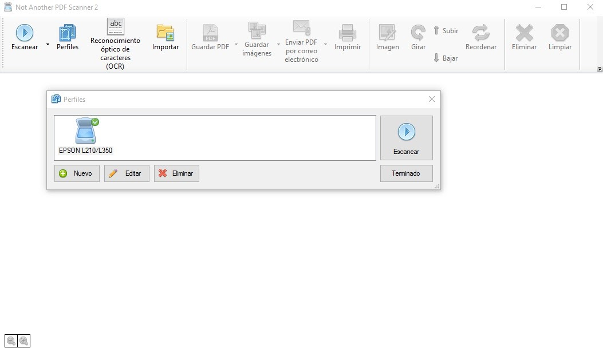
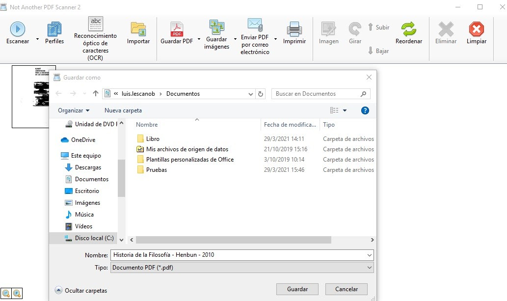

# Guía de Digitalización del Centro de Documentación Regional Juan Bautista Vázquez
## Objetivo
El objetivo de la presente guía es establecer los parámetros y secuencia de las actividades a ejecutar durante el proceso de digitalización de las colecciones en soporte papel, así como la conservación digital y las formas de acceso a la información digitalizada que gestione el Centro de Documentación Regional Juan Bautista Vázquez de la Universidad de Cuenca.

## Alcance
La presente guía aplica para las bibliotecas que conforman al Centro de Documentación Regional Juan Bautista Vázquez y sus respectivas colecciones bibliográficas. Cabe mencionar que este es un proceso transversal a la organización puesto que es un servicio enfocado al usuario por lo que pueden intervenir personal del área de servicios o de procesos técnicos.

## Terminología
__PDF:__ es un formato de almacenamiento para documentos digitales independiente de plataformas de software o hardware. 

__OCR:__ (Reconocimiento óptico de caracteres) es un sistema computarizado de análisis que permite escanear un documento de texto en un fichero automatizado electrónicamente, que se puede editar con un procesador de textos en el ordenador.

__Resolución de imagen:__ se refiere al número de píxeles que conforman una imagen digital, el cual señala la cantidad de detalles que esta tiene. Mientras más píxeles, mejor será la resolución.

__Compresión de imagen:__ el proceso de minimizar el tamaño de un archivo de imagen en bytes, sin degradar la calidad de la imagen más allá de un límite razonable.

__Preservación digital:__ La preservación digital es el conjunto de técnicas y de metodologías que permiten que la información almacenada digitalmente en cualquier tipo de formato, programa, máquina o sistema continúe siendo accesible a medio y largo plazo.

__Conservación:__ como método de trabajo que cubre tres aspectos: la evaluación del objeto, la preservación y el tratamiento de conservación de los materiales y su restauración.

__Acervo:__ colección bibliohemerográfica de una biblioteca determinada, que puede estar compuesta por libros, revistas y diarios, material digital y tridimensional, entre otros.

__Profundidad de color:__ el número de bits utilizados para indicar el color de un píxel en una imagen digital. 

__Soporte:__ Se establece el medio en el que se encuentra contenida la información.

__Metadatos:__ Consiste en crear datos vinculados a la información para la correcta identificación y descripción de los documentos. La técnica que prioriza los metadatos es una de las opciones más importantes y en las que las instituciones y la comunidad científica se muestra más interesada.

## Objetivos y beneficios de la digitalización de colecciones
- Optimizar tiempo.
- Mejorar el servicio de préstamo bibliotecario.
- Alcanzar a más usuarios con un mismo recurso.
- Evitar la pérdida de material bibliográfico.
- Ahorro de espacio físico.
- Mejorar la productividad del personal bibliotecario.
 
## Descripción del proceso de digitalización.
El proceso de digitalización involucra las siguientes actividades:

- Selección de documentos.
- Preparación de estación de trabajo.
- Preparación de los documentos para el proceso de digitalización.
- Registro de digitalización.
- Medidas de prevención durante el proceso de digitalización
- Acciones de digitalización.
- Carga de metadatos y asignación de nomenclatura.
- Almacenamiento de los documentos digitales.
- Acciones de preservación digital.
- Formas de acceso a la información digitalizada.

## Criterios de selección de los documentos a digitalizar.
Para poder iniciar el proceso de digitalización se deberá seleccionar los documentos en base a los siguientes criterios de valoración:

- Frecuencia de consulta del documento.
- Estado de conservación de los documentos: estabilidad física del soporte y deterioros mecánicos.
- Cantidad de volúmenes publicados.
- Importancia histórica, social o patrimonial del documento.
- Viabilidad de equipamientos y personal para llevar a cabo el proceso de digitalización.
- Libros que se encuentran en los sílabos de las carreras de la Universidad de Cuenca.

## Acciones de verificación antes de digitalizar.
Con la finalidad de garantizar que el proceso de digitalización se realice de forma efectiva, antes de proceder con la digitalización se deberá comprobar en el documento los siguientes aspectos:

- Verificar en el registro de digitalización que el documento no ha sido previamente digitalizado.
- En caso de existir varios ejemplares de la obra seleccionar la que se encuentre en mejores condiciones de conservación.
- Verificar que el documento pueda soportar el proceso de digitalización.

## Estaciones de trabajo para la digitalización
El proceso de digitalización se realizará de manera descentralizada por lo que cada biblioteca que conforma al CDR-JBV deberá de establecer una estación de digitalización, la misma deberá contar con lo siguiente:

- Scanner o impresora con scanner que permite una resolución de más de 300 dpi, dimensiones iguales o superiores a 21,6 x 29,7 cm., escala de colores hasta los 24 bits y controlador WIA o TWAIN.
- Computador que disponga de un procesador, memoria RAM y disco duro de amplia capacidad.
- Software NAPS2 (Not Another PDF Scanner). El mismo es gratuito, de código abierto y permite el reconocimiento óptico de caracteres (OCR).
- Teléfono celular con una camara mayor a 12 Mpx.

## Medidas de prevención antes de digitalizar
La prevención es una actividad fundamental para el cuidado de la salud del personal, documentos y equipos que intervienen en el proceso de digitalización por lo que se deberán de tener en cuenta las siguientes medidas:

- Uso de equipo de protección individual (mascarilla y guantes)
- No forzar mucho la encuadernación durante el proceso de escaneo.
- Pasar cuidadosamente las hojas de los documentos.
- Evitar realizar dobleces en las hojas.
- Evitar la manipulación del libro por las zonas frágiles.
- El libro debe de estar correctamente almacenado durante el proceso: su ubicación debe ser vertical para los libros de pequeño y mediano tamaño, y los libros de gran formato se deben colocar de manera horizontal y con un máximo de tres libros apilados.
- No se debe consumir bebidas o alimentos durante el proceso de digitalización.
- Las estaciones de trabajo deben de estar limpias y ordenadas.

## Acciones de digitalización para documentos en formato papel.
### Registro de digitalización
Antes de comenzar la digitalización se deberá incluir el documento en el registro de documentos digitalizados. En el mismo se deberán llenar las siguientes columnas:

- Fecha de Digitalización: fecha en que inicia la digitalización, formato de fecha dd/mm/aaaa.
- Datos del libro: poner el título del libro, autor, edición y año de publicación separados por un guión medio “-”.
- Signatura.
- Código de barras.
- Campus.
- No de hojas: Cantidad de hojas total del documento a digitalizar.
- Modo: Seleccionar con una X la escala de colores que se utilizó para la digitalización: Blanco y Negro, escala de grises o color 24 bits.
- Resolución (dpi): Seleccionar la resolución utilizada 200dpi, 300dpi o 400dpi.
- OCR: Seleccionar con una X si se realizó el reconocimiento óptico de caracteres al documento.
- Modelo de Scanner: Seleccionar el modelo del equipo que se utilizó para digitalizar.
- Responsable de la digitalización: Persona que realiza o supervisa el proceso de digitalización.

### Especificaciones técnicas para captura digital
El Centro de Documentación Regional Juan Bautista Vázquez por motivos de almacenamiento ha decidido que en el proceso de digitalización no existirán copias master sino que directamente se convertirán todas las imágenes en el estándar de formato PDF/A-3b, debido a que es un formato adecuado para la conservación a largo plazo de los documentos además que esta versión permite compresión, elementos transparentes y capas. 
>El PDF/A es un PDF diseñado para el archivado de documentos a largo plazo. Se sustenta por la Norma Técnica ISO 19005-1:2005. Para este caso largo plazo es la expresión utilizada para identificar la necesidad de preservar funcionalmente documentos electrónicos por espacios de tiempo superiores a 5 años. PDF/A es el primer formato de archivo electrónico convertido en estándar ISO, que garantiza que los documentos que se crean hoy, se podrán abrir y utilizar en el futuro.
(Archivo General de la Nación de Colombia, 2017, p.9)

Para páginas de libros donde solo aparezca texto se utilizará la siguiente configuración:

| **Calidad**  | **Resolución**  | **Profundidad de color**  | **Formato**  | **Compresión**  | **Características** |
| ------------ | --------------- | ------------------------- | ------------ | --------------- | ------------------- |
| Óptima | 300 dpi | Blanco y negro | PDF | Ninguna | OCR |

Para páginas de libros donde solo imágenes se utilizará la siguiente configuración:

| **Calidad**  | **Resolución**  | **Profundidad de color**  | **Formato**  | **Compresión**  | **Características** |
| ------------ | --------------- | ------------------------- | ------------ | --------------- | ------------------- |
| Óptima       | 300 dpi         | Color 24 bits             | PDF          | Ninguna         | OCR                 | 
  
>

### Digitalización con software NAPS2:  
Paso 1: Abrir Software

  
  Paso 2: Seleccionar el botón **Perfiles**

  
  Paso 3: Hacer click en el botón **editar** y ajustar los parámetros según sea el caso.

  
  Paso 4: Hacer click en el botón **Reconocimiento Óptico de Caracteres OCR** y seleccionar el idioma **Spanish**, poner en modo OCR en **Best** y seleccionar la opción de ejecutar automáticamente.
  
  
  Paso 5: Comenzar a digitalizar haciendo click en el botón Escanear:


### Digitalzación con dispositivos móviles

### Metadatos
Los metadatos que se cargarán al documento pdf serán los siguientes:

| **Metadatos** | **Descripción** |
| ------------- | ----------------|
|**Título**| Transcribir el título de la obra original.  Utilizar mayúsculas únicamente en la primera palabra del título y en nombres propios. Los subtítulos deben separarse del título mediante dos puntos, precedidos y seguidos por un espacio. ```Ejemplo: El quechua y el cañari: contribución para la historia precuencana```|
|**Autor**| Para nombres personales utilizar el formato continuo de tal forma que la sintaxis sea: “Nombres” + “Apellidos”. En caso de tener varios autores se deberán separar por puntos.  ``Ejemplo: Octavio Cordero Palacios. Enmanuel Kant``|
|**Materia**| La materia se pondrá de acuerdo a su clasificación en el sistema de clasificación que implementa la biblioteca (Clasificación Decimal Dewey). Los términos se consignan sólo con la primera palabra en mayúsculas. ```Ejemplo: Lenguas indígenas```|
|**Palabras clave**| Las palabras claves son de libre asignación por parte del bibliotecario y deberán estar separadas por puntos. ```Ejemplo: Historia. Filosofía. Pensadores```|    
  
  >  

Paso 1: Una vez escaneada las páginas se procede a configurar el pdf para exportar las imágenes haciendo click en la flecha hacia abajo del botón **Guardar PDF** y seleccionamos **Configuración del PDF**.

  
  Paso 2: Establecer los metadatos correspondientes (ven en la sección metadatos) y en compatibilidad seleccionar el modo PDF/A-3b y hacer click en el botón **Aceptar**.


### Nomenclatura de los archivos
Una vez escaneado todo el documento e incluidos los metadatos se procederá a guardar el documento. Para confeccionar los nombres de los documentos se utilizarán los siguientes elementos y estructura:
  
|  **Elementos**   |  **Descripción**   |  
| ---------------- | ------------------ |
| **Título**   | Se pondrá el título principal de la obra, no se incluye el subtítulo |
| **Autor**    | Se pondrá solo el primer apellido del primer autor.                  |
| **Edición**  | Se pondrá el número de la edición                  |  

> 

  **Estructura**  ``Título - Apellido - Edición``   
  **Ejemplo**     ``Historia de la Filosofía - Delius - 3ed.pdf``

  Paso 1: Hacer click en el botón Guardar PDF, poner el nombre del archivo y guardar en la carpeta seleccionada.


  
!!! note "Informacion importante"
     Hola mundo